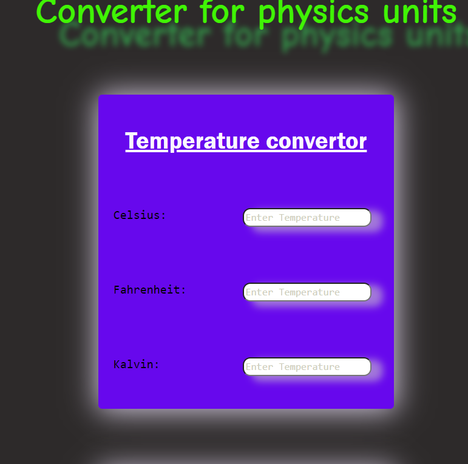
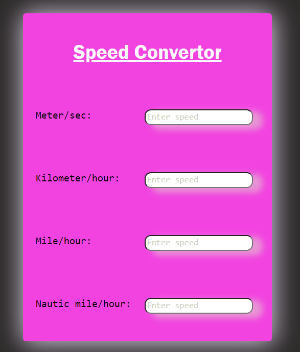
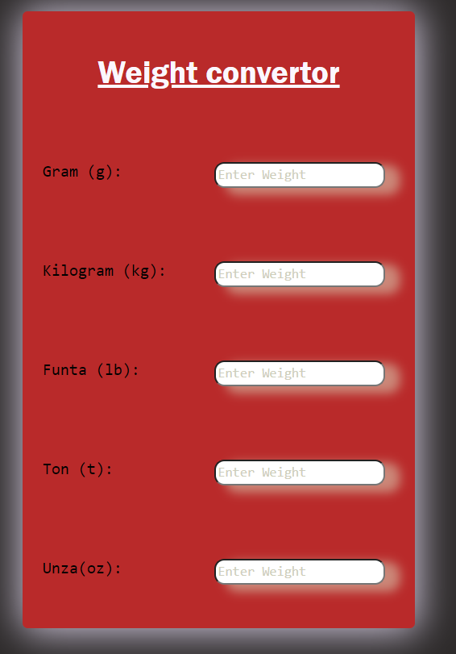
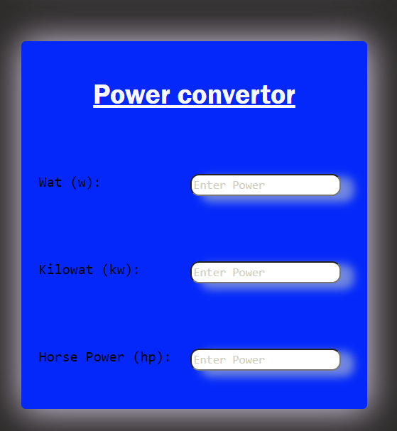

# Konvertor Fizičkih Jedinica

Ova aplikacija omogućava jednostavnu konverziju između različitih
fizičkih jedinica, uključujući:

##LINK: https://physics-units-converting.netlify.app/

-App je responzivna i moze se koristiti i na mobilnom telefonu!

- **Težina**: Kilogrami, funte, grami, unce.
- **Brzina**: Kilometri na sat, milje na sat, metri po sekundi.
- **Temperatura**: Celzijus, Farenhajt, Kelvin.
- **Snaga**: Vati,KW i konjske snage.

## Tehnologije Korišćene

- **HTML**: Za strukturu interfejsa.
- **CSS**: Za stilizaciju stranice.
- **JavaScript**: Za logiku konverzije između jedinica.

## Kako Koristiti Aplikaciju

1. Izaberite kategoriju (težina, brzina, temperatura, snaga).
2. Unesite vrednost i dobijate konvertovane vrijednosti.
3. Rezultati će biti automatski prikazani.

